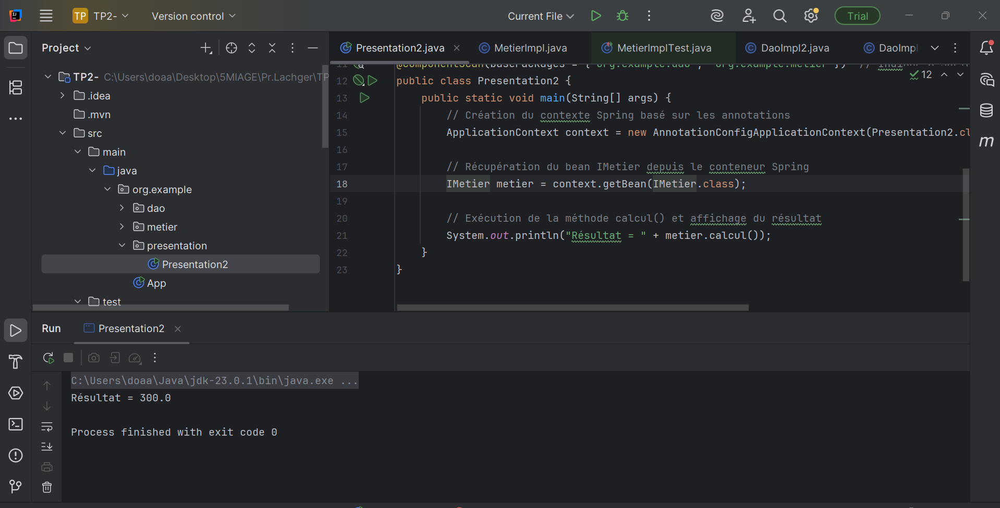

# 🧩 TP2 — Injection de Dépendances avec Spring Framework

## 🎯 Objectif du TP
Ce TP a pour objectif de comprendre comment **Spring Framework** gère l’**inversion de contrôle (IoC)** et l’**injection de dépendances (DI)** à travers :
- la **configuration XML**,  
- les **annotations (@Component, @Autowired, @Qualifier, @Primary)**,  
- et la **configuration Java via @Configuration et @Bean**.

---

## 🧠 Concepts abordés
- **Inversion de contrôle (IoC)** : déléguer à Spring la création et la gestion des objets.  
- **Injection de dépendances (DI)** : relier dynamiquement les composants entre eux.  
- **Annotations Spring** : `@Component`, `@Autowired`, `@Qualifier`, `@Value`, `@Primary`, `@Configuration`, `@Bean`.  
- **Scopes** : `singleton` vs `prototype`.  
- **Fichier de configuration XML et/ou Java** pour l’assemblage des beans.

---

